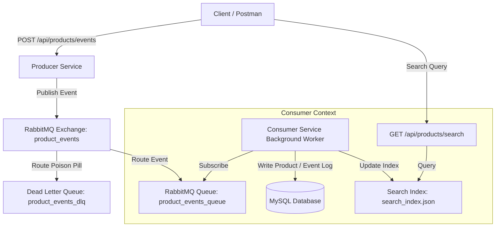

# Event-Driven Product Catalog Microservice

A scalable, event-driven backend microservice responsible for managing a product catalog and asynchronously updating a search index. This project demonstrates event-driven architecture (EDA) principles using Django (Python), RabbitMQ, and MySQL, with Docker containerization and comprehensive automated testing.

## System Architecture

The system consists of two decoupled microservices that communicate asynchronously using RabbitMQ:



### Key Architectural Features

1. **Multi-Stage Docker Builds**:
   Both services use multi-stage Docker builds to minimize production image size and maximize security. The compiler tools and development files (like `build-essential` and `default-libmysqlclient-dev` needed for compilation) are restricted to the `builder` stage, keeping the `runner` stage clean and lightweight.
   
2. **Resilient HTTP Communication**:
   The Producer API gracefully catches RabbitMQ broker connection failures (e.g. `pika.exceptions.AMQPConnectionError`) and returns a descriptive `503 Service Unavailable` status code to the client instead of crashing or yielding a generic `500` server error.

3. **Transaction-Consistent Search Index Sync**:
   The background consumer synchronizes the local JSON search index *after* the MySQL transaction commits successfully. This prevents inconsistencies where a database write fails but the search index is modified anyway.

4. **Idempotency with Auto-Repair**:
   To prevent duplicate processing from corrupting data, every incoming event is registered in a `ProcessedEvent` table. On duplicate event delivery, the consumer performs an automatic check and sync of the local search index for that product before safely acknowledging the message and returning.

5. **Local Retry & Dead Letter Queue (DLQ)**:
   If event processing fails due to a transient exception (such as a database timeout or index write error), the worker retries the operation locally up to 3 times (with a 1-second delay). If all 3 attempts fail, the message is rejected with `requeue=False`, routing it automatically to the Dead Letter Queue (`product_events_dlq`) for inspection.

---

## Setup & Deployment

Ensure you have Docker and Docker Compose installed.

### 1. Configure Environment Variables
Copy the env template to create a `.env` file in the root directory:
```bash
cp .env.example .env
```

### 2. Launch Services
Start the MySQL, RabbitMQ, and Django microservice containers in detached mode:
```bash
docker-compose up -d --build
```
This command orchestrates four containers:
- `mysql` (running MySQL 8.0 with health check on port `3307` host, `3306` inside network)
- `rabbitmq` (running RabbitMQ 3-management on ports `5672` and `15672`)
- `producer-service` (listening on port `8000`)
- `consumer-service` (listening on port `8001`)

### 3. Verify Container Status
Wait for all services to pass their health checks:
```bash
docker-compose ps
```

---

## API Reference

### 1. Publish Product Lifecycle Event
- **Method**: `POST`
- **Path**: `/api/products/events`
- **Port**: `8000` (Producer)
- **Response**: `201 Created` on successful publishing, `400 Bad Request` on invalid schema, or `503 Service Unavailable` if RabbitMQ is unreachable.

**Payload Schema**:
- `event_type`: Must be one of `ProductCreated`, `ProductUpdated`, `ProductDeleted`.
- `product_id`: Unique product identifier (string).
- `payload`: Object containing product attributes. For `ProductCreated`, `name`, `description`, `price`, and `stock` are mandatory.

**Example Request (`ProductCreated`)**:
```bash
curl -X POST http://localhost:8000/api/products/events \
  -H "Content-Type: application/json" \
  -d '{
    "event_type": "ProductCreated",
    "product_id": "prod_123",
    "payload": {
      "name": "Wireless Earbuds",
      "description": "High-fidelity audio, noise-cancelling.",
      "price": 129.99,
      "stock": 100
    }
  }'
```

**Example Request (`ProductUpdated`)**:
```bash
curl -X POST http://localhost:8000/api/products/events \
  -H "Content-Type: application/json" \
  -d '{
    "event_type": "ProductUpdated",
    "product_id": "prod_123",
    "payload": {
      "price": 119.99,
      "stock": 80
    }
  }'
```

**Example Request (`ProductDeleted`)**:
```bash
curl -X POST http://localhost:8000/api/products/events \
  -H "Content-Type: application/json" \
  -d '{
    "event_type": "ProductDeleted",
    "product_id": "prod_123",
    "payload": {}
  }'
```

### 2. Query Local Search Index
- **Method**: `GET`
- **Path**: `/api/products/search` (supports with and without trailing slash: `/api/products/search/`)
- **Port**: `8001` (Consumer)
- **Parameters**: `q={search_term}`
- **Response**: `200 OK` with JSON array of matched products. Queries the local index file, not the MySQL database.

**Example Request**:
```bash
curl "http://localhost:8001/api/products/search?q=earbuds"
```

**Example Response**:
```json
[
  {
    "id": "prod_123",
    "name": "Wireless Earbuds",
    "description": "High-fidelity audio, noise-cancelling.",
    "price": "119.99"
  }
]
```

---

## Running Tests

Automated unit and integration tests are included for both services.

### Option A: Run Tests Locally (Fastest)

Ensure you have a Python virtual environment activated and dependencies installed:
```bash
# Set up virtual environment
python -m venv venv
venv\Scripts\activate # On Windows
source venv/bin/activate # On Unix/macOS

# Install dependencies
pip install -r producer-service/requirements.txt
pip install -r consumer-service/requirements.txt
```

Run pytest inside each service folder:
```bash
# Test Producer Service
cd producer-service
pytest

# Test Consumer Service (uses automatic SQLite override for test isolation)
cd ../consumer-service
pytest
```

### Option B: Run Tests Inside Containers

Run tests within the active Docker Compose containers:
```bash
# Test Producer Service
docker-compose exec producer-service pytest

# Test Consumer Service
docker-compose exec consumer-service pytest
```
